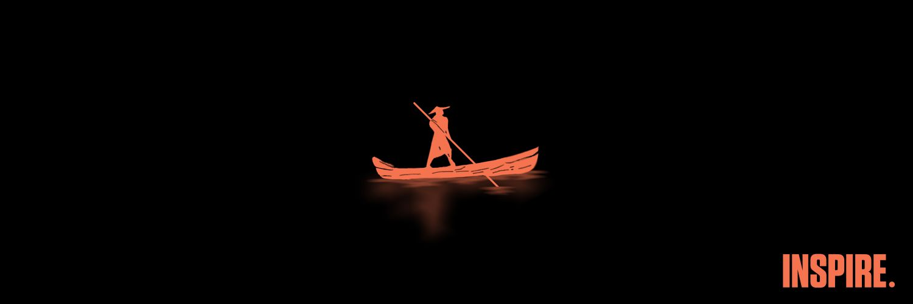

## Awesome Developer, Awesomer Designer

## Hey there, I'm Mehdi (aka Fluka)

I am a graphic and UI/UX designer with four years of experience. Currently, I am a college student majoring in network engineering and a passionate developer. I just love creating stuff

### A Jack of all trades, A master of these :

#### Programming Languages

  
  
  
  
  

#### Frameworks and Libraries

  
  

#### Tools & Software

  
  
  
  

### Currently Working On

---

Feel free to reach out if you're interested in collaborating or just want to chat!

  
  
  

